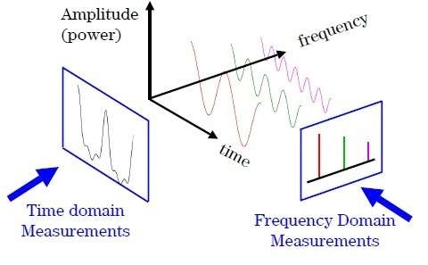

## Introduction

## Classical Fourier Transform

$$
\hat{f}(\xi) = \int_{\mathbb{R}} f(t) e^{-2\pi i\xi t}dt
$$

## Graph Fourier Transform

$$
\hat{f}(\lambda_l) = \sum^N_{i=1} f(i)u^{\ast}_l(i)
$$

$$
f(i) = \sum^{N-1}_{i=0} \hat{f}(\lambda_l)u_l(i)
$$
