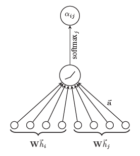
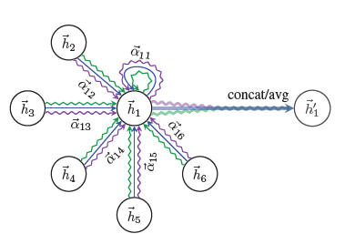
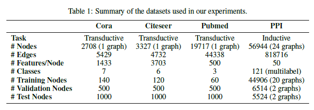
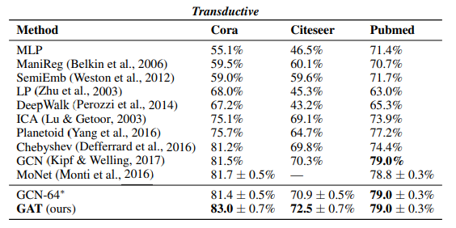
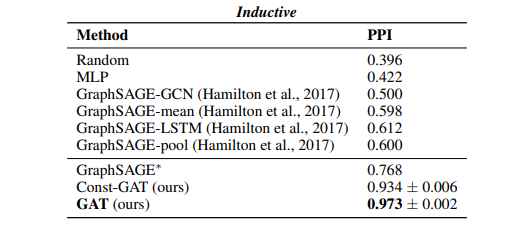
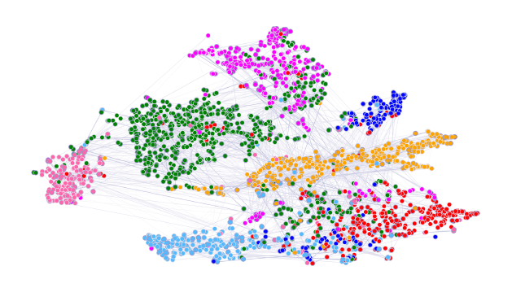

[paper review] : Graph Attention Networks 이해하기

## Introduction

CNN 은 image classification, semantic segmentation, machine translation 등 다양한 분야에 적용되어 좋은 성능을 보여주었습니다. CNN 의 핵심인 convolution 은 주어진 data 의 구조가 grid-like (Euclidean domain) 특성을 가질 때 정의됩니다. 3D mesh, social network, biological network 등과 같이 data 의 구조가 irregular 한 경우, 

 data 는 그래프의 형태로 잘 표현 됩니다. 

그렇기 때문에, 그래프 data 에 대해 convolution operator 를 일반화시키기 위한 다양한 연구가 이루어지고 있습니다.

Graph domain 에서 convolution 을 일반화시키는 연구는 크게 두 가지로 나눌 수 있습니다.

첫번째 방법은, Fourier domain 에서 정의된 convolution 을 이용한 spectral approach 입니다. Spectral approach 는 graph Laplacian 의 eigendecomposition 을 통해 convolution 을 정의합니다. 이 때 복잡한 행렬 연산과 non-spatially localized filter 의 문제를 해결하기 위해, ChebNet 은 graph Laplacian 의 Chebyshev expansion 을 적용했습니다. 더 나아가 [2] 에서는 Chebyshev approximation 을 각 node 의 1-step neighborhood 에 한정시켜 

하지만 spectral approach 의 가장 큰 문제점은 바로 그래프의 전체 구조에 의존한다는 것입니다. Input graph 에 따라 graph Laplacian 이 변하기 때문에, inductive learning 에 직접 적용될 수 없습니다.

두번째 방법은, non-spectral approach 입니다. 

공간적으로 가까운 neighbor 를 통해 그래프에서 직접 convolution 을 정의합니다. Grid-like structured data 와 다르게, 그래프에서는 

크기가 다른 neighborhood 에 대해서도 적용되며, CNN 의 weight-sharing 특성을 유지하는 convolution 을 정의하기 

대표적인 예로 MoNet 과 GraphSAGE [3] 가 있습니다. Spectral approach 와 같이 그래프 전체의 구조에 의존하지 않기 때문에, inductive learning 이 가능합니다.

논문은 [4] 의 attencion mechanism 

## GAT Architecture

&nbsp;

GAT 를 이루는 graph attentional layer 는 

$$N$$ 개의 node 를 가지는 그래프에 대해, 각 node 의 feature 를 vector $$h_i\in\mathbb{R}^F$$ 로 나타냅니다. 여기서 $$F$$ 는 feature 들의 개수이며, node 의 ordering 에는 의미가 없고 단순히 node 를 구분하기 위한 notation 입니다. Node 의 feature vector 를 $$h'_i\in\mathbb{R}^{F'}$$ 으로 update 한다면 

모든 node 들에 대해 공통된 weight matrix $$W\in\mathbb{R}^{F\times F'}$$ 를 통해 선형 변환 이후, 

공통된 attentional mechanism $$\mathcal{A}:\mathbb{R}^{F'}\times\mathbb{R}^{F'}\rightarrow\mathbb{R}$$ 을 통해 attention coefficients $$e_{ij}$$ 를 다음과 같이 계산합니다.
$$
e_{ij} = \mathcal{A}\left( Wh_i, Wh_j \right)
\tag{1}
$$
attention coefficient $$e_{ij}$$ 는 node $$i$$ 에 대한 node $$j$$ 의 중요도 (importance) 를 의미합니다. 

만약 모든 node 들의 쌍에 대한 attention coefficient 를 사용한다면, 그래프의 구조적인 특성을 살릴 수 없습니다. GAT 의 핵심은, 바로 node $$i$$ 의 neighborhood $$N_i$$ 에 속하는 node $$j$$ 들에 대한 $$e_{ij}$$ 를 사용하는 것입니다. 이렇게 masked attention 을 통해 그래프의 구조에 대한 정보를 이용할 수 있습니다.

각 node 들에 대해 $$(1)$$ 의 coefficient 들을 비교할 수 있도록, 정규화가 필요합니다. 

[4] 의 attention mechanism 과 같이 softmax 함수를 통해 normalize 해줍니다.
$$
\alpha_{ij} = \text{softmax}_j(e_{ij}) = \frac{\exp(e_{ij})}{\sum_{k\in N_i}\exp(e_{ik})}
\tag{2}
$$

이 논문에서는 attentional mechansim $$\mathcal{A}$$ 를 weight vector $$a\in\mathbb{R}^{2F'}$$ 와 activation function 으로 LeakyReLU 를 사용해 다음과 같이 정의합니다.
$$
\mathcal{A}\left( Wh_i, Wh_j \right)
= \text{LeakyReLU}\left( a^T\left[ Wh_i\vert\vert Wh_j \right] \right)
\tag{3}
$$

    

$$(2)$$ 를 다시 쓰면, 
$$
\alpha_{ij} = \frac{\exp\left( \text{LeakyReLU}\left( a^T\left[ Wh_i\,\Vert\, Wh_j \right] \right) \right)}{\sum_{k\in N_i}\exp\left(\text{LeakyReLU}\left( a^T\left[ Wh_i\,\Vert\, Wh_k \right] \right)\right)}
\tag{4}
$$

$$(4)$$ 를 통해 계산한 정규화된 attention coefficient 들을 통해 다음과 같이 node $$i$$ 의 feature vector 를 update 해줍니다.
$$
h^{(l+1)}_i = \sigma\left( \sum_{j\in N_i}\alpha_{ij}Wh^{(l)}_j \right)
\tag{5}
$$

assigning different importances to to nodes of same neighbors

GCN layer-wise propagation rule
$$
h^{(l+1)} = \sigma\left( \sum_{j\in N_i}\frac{1}{c_{ij}}Wh^{(l)}_j \right)
$$

Self-attention 의 학습 과정을 안정화시키기 위해, multi-head attention 을 적용했습니다.

    

각 layer 마다 $$K$$ 개의 independent 한 attention mechanism $$(5)$$ 들을 사용해 

다음과 같이 새로운 layer-wise propagation rule 을 제시합니다.
$$
h^{(l+1)} = \Big\Vert^{K}_{k=1} \sigma\left( \sum_{j\in N_i}\alpha^{k}_{ij}W^kh^{(l)}_j \right)
\tag{6}
$$
 $$l$$ 번째 layer 의 output feature vector $$h^{(l+1)}$$ 은 $$KF^{(l+1)}$$ 개의 feature 들을 가지게 됩니다.

마지막 layer 에서는 concatenation 의 의미가 없으므로, 대신 feature 들의 averaging 을 통해 final output 을 만들어줍니다.

$$
h^{(L)} = \sigma\left( \frac{1}{K}\sum^K_{k=1}\sum_{j\in N_i}\alpha^{k}_{ij}W^kh^{(L-1)}_j \right)
\tag{7}
$$

highly efficient : self-attentional layer 모든 edge 들에 대해 parallelized , 

각 node 들의 feature vector update 또한 각 node 들에 대해 parallelized

특히 GCN 과 같이 eigenvalue decomposition 혹은 그와 비슷한 복잡한 행렬 연산이 필요하지 않습니다.

$$(6)$$ 에서 $$K=1$$ 일 때의 computational complexity $$O\left(\vert V\vert FF' + \vert E\vert F'\right)$$ 

GCN 과 비슷한 복잡도

### GAT vs GCN

GCN 과의 가장 큰 차이는 위에서 설명했듯이, 동일한 neighborhood 내의 node 들에 대해 다른 importance 를 부여할 수 있다는 점입니다. 특히 모델을 학습시킨 후, 학습된 attentional weight 는 모델에 대한 해석에 큰 도움을 줄 수 있습니다.

또한 GCN 은 Fourier domain 에서 정의된 convolution 

graph Laplacian 

이는 학습 전에 그래프의 구조에 대한 정보를 알고 있어야합니다.

결국 GCN 과 다르게 바로 inductive learning 에 적용할 수 있습니다.

### GAT vs GraphSAGE

sample fixed-size neighborhood due to computational footprint consistency

추론을 진행할 때, neighborhood 전체에 대한 정보를 사용할 수 없습니다.

특히 LSTM 을 aggregator function 으로 사용한 GraphSAGE 와 다르게, node 의 ordering 과 상관 없다

&nbsp;

## Evaluation

&nbsp;

### Datasets

GAT 모델을 다른 baseline 모델들과 비교하기 위해, 잘 알려진 4 가지 dataset 에서 실험을 진행했습니다. Transductive learning 의 performance 측정을 위해 Cora, Citeseer, Pubmed 세 가지의 citation network dataset 을 사용했습니다. 또한 inductive learing 의 performance 측정을 위해 protein-protein interaction (PPI) dataset 에서도 실험을 수행했습니다.

각 dataset 의 특징은 아래의 table 1 에 정리되어 있습니다. 

### Transductive Learning

Transductive learning task 의 baseline 들로는 [2] 의 실험에서 사용된 baseline 들과 GCN 을 사용했습니다.

GAT 와 baseline 모델들의 성능은 mean classification error 로 측정되었으며, 아래의 표에 정리되어 있습니다.

    

GCN 의 performance 와 비교를 통해, 같은 neighborhood 내의 node 들에 대해 다른 weight 를 부여하는 것이 효과적임을 알 수 있습니다.

### Inductive Learning

Transductive learning 의 baseline 들로 활용된 모델들은 inductive learning 에 직접적으로 적용되기 힘들기 때문에, inductive learning baseline 에서 제외했습니다. Inductive learning task 의 baseline 들로는 GraphSAGE 의 variant 들을 선택했습니다. 특히 GraphSAGE 모델 중 성능이 좋다고 알려진 두 모델 : pool aggregator 를 사용하는 GraphSAGE-pool 과 LSTM aggregator 를 사용하는 GraphSAGE-LSTM 과 더불어 aggregator 로 GCN 또는 mean 을 사용한 GraphSAGE-GCN, GraphSAGE-mean 총 네 개의 모델을 골랐습니다. 

또한, GAT 모델이 그래프 구조에 대한 정보를 이용하는지 확인하기 위해, 그래프의 구조를 전혀 이용하지 않는 multilayer perceptron (MLP) classifier 와 비교했습니다.

특히, GAT 모델의 특징 중 한 가지가 바로 같은 neighborhood 내의 node 들에 대해서 다른 weight 를 부여할 수 있다는 것인데, 이를 확인하기 위해 constant attention mechanism 을 사용한 Const-GAT 모델을 GAT 모델과 함께 비교했습니다.

GAT 와 baseline 모델들의 성능은 micro-averaged $$F_1$$ score 로 측정되었으며, 아래의 표에 정리되어 있습니다.

    

GraphSAGE 의 performance 와 비교를 통해, neighborhood 의 일부만 sampling 하는 것보다 전체 neighborhood 를 이용하는 것이 효과적임을 확인할 수 있습니다. 또한 Const-GAT 모델과의 비교를 통해 다시 한번 같은 neighborhood 내의 node 들에 대해서 다른 weight 를 부여하는 것이 중요하다는 것을 알 수 있습니다.

논문에선는 GAT 모델을 통해 학습한 feature representation 을 눈으로 확인하기 위해, data visualization 을 위해 많이 사용되는 t-SNE (stochastic neighbor embedding) 를 아래의 그림과 같이  시각화 했습니다.

    

Node 의 색은 각각의 7개의 class 에 해당하며, 눈으로 확연히 구분될 정도로 clustering 이 된 것을 볼 수 있습니다.

&nbsp;

## Conclusion

&nbsp;

GAT 는 graph-structured data 에 적용될 수 있는 convolutin-style 의 neural network 로 다음과 같은 특징을 가지고 있습니다.

> Computationally Efficient

parallelizable across all nodes without intensive matrix operation

> Different Importance

같은 neighborhood 내의 node 들에 대해 다른 weight 을 부여해줄 수 있습니다.

> Inductive Learning

기존의 모델들과 다르게

서로 다른 degree 를 가지는 경우에도 적용할 수 있으며, 

spectral approach 와 다르게 그래프의 전체 구조에 의존하지 않기 때문에, inductive learning 또한 가능합니다.

GAT 는 

특히 attention mechanism 을 사용했기 때문에, 모델의 interpretability

graph classification

edge feature 

## Reference

1. Petar Veliˇckovi´c, Guillem Cucurull, Arantxa Casanova, Adriana Romero, Pietro Lio, and Yoshua
   Bengio. [Graph attention networks](https://arxiv.org/pdf/1710.10903.pdf). arXiv preprint arXiv:1710.10903, 2017.

2. Thomas N Kipf and Max Welling. [Semi-supervised classification with graph convolutional networks](). arXiv preprint arXiv:1609.02907, 2016.

3. Will Hamilton, Zhitao Ying, and Jure Leskovec. [Inductive representation learning on large graphs](https://arxiv.org/pdf/1706.02216.pdf). In Advances in Neural Information Processing Systems, pages 1024–1034, 2017.

4. Dzmitry Bahdanau, Kyunghyun Cho, and Yoshua Bengio. [Neural machine translation by jointly
   learning to align and translate](https://arxiv.org/pdf/1409.0473.pdf). International Conference on Learning Representations (ICLR),
   2015.