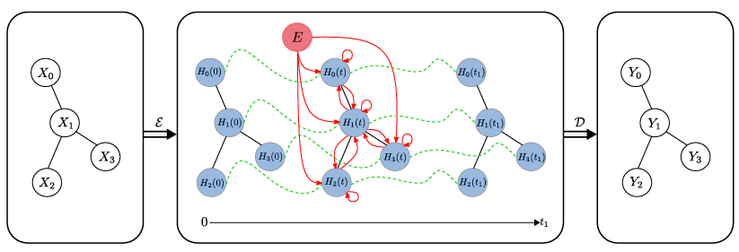
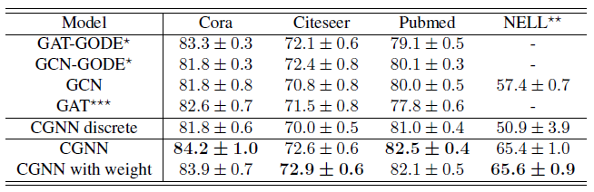
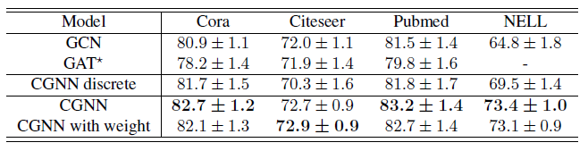
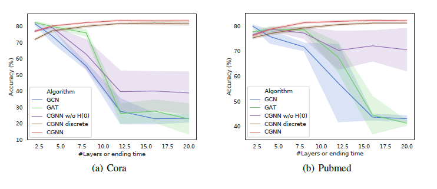
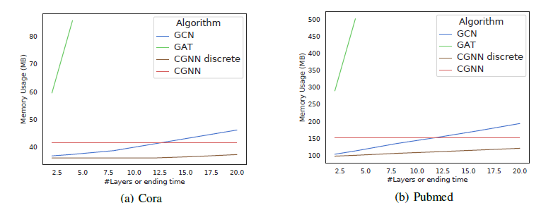

[paper review] CGNN 이해하기

## Introduction

&nbsp;

GCN 의 propagation rule 은 neighbor node representation 들을 통해 node representation 을 update 합니다 [3]. 이 때 update 과정에서 각 node 와 주변의 node 들의 representation 이 점점 비슷해집니다. GCN layer 를 많이 쌓을수록 node 들의 representation 이 같은 값으로 수렴하는 over-smoothing 이 발생하기 쉽고, 이는 GCN 의 performance 를 저해하게 됩니다 [4]. 깊은 GNN 모델은 node feature 들의 복잡한 상호작용을 표현할 수 있기 때문에, over-smoothing 을 해결하는 것이 GNN 의 성능 향상에 중요합니다. 

또한 기존의 GNN 은 node representation 의 이산적 변화만을 모델링할 수 있습니다.

최근 [2] 에서 ODE solver 를 활용해 

논문에서는 node representation 의 변화를 ODE 를 통해 정의하여, node representation 의 시간에 따른 연속적인 변화를 표현할 수 있는 모델 CGNN 을 제시합니다. 이를 통해 over-smoothing 문제를 해결하고, node 들의 long-range dependency 를 학습할 수 있도록 합니다. 

&nbsp;

## Preliminaries

&nbsp;

simple undirected graph $$G=(V,E)$$ 에 대해 adjacent matrix 를 $$Adj$$ 라고 하겠습니다. [3] 에서는 degree matrix $$D$$ 와 normalized adjacent matrix $$D^{-1/2}Adj\,D^{-1/2}$$ 를 통해 정의된 matrix $$I + D^{-1/2}Adj\,D^{-1/2}$$ 를 사용하여 GCN 의 propagation rule 을 정의합니다. 

이 때 $$I + D^{-1/2}Adj\,D^{-1/2}$$ 의 eigenvalue 는 $$[0,2]$$ 구간에 존재하기 때문에, $$I + D^{-1/2}Adj\,D^{-1/2}$$ 를 사용한 layer 들을 많이 거칠 경우 exploding / vanishing gradient 와 같은 instability 가 발생할 수 있습니다 [3]. 따라서 [3] 에서는 renormalization trick 을 통해 

$$I + D^{-1/2}Adj\,D^{-1/2}$$ 대신 $$\hat{A} = \tilde{D}^{-1/2}\tilde{A}\,\tilde{D}^{-1/2}$$ 
$$
H_{n+1} = \hat{A}\,H_n\Theta
$$

논문에서는 $$I + D^{-1/2}Adj\,D^{-1/2}$$ 의 eigenvalue 크기를 조절하기 위해, renormalization trick 대신 hyperparameter $$\alpha\in (0,1)$$ 을 사용해, 다음과 같은 regularized adjacency matrix $$A$$ 를 사용합니다.

$$
A = \frac{\alpha}{2}\left(I + D^{-1/2}Adj\,D^{-1/2} \right)
\tag{1}
$$

정의에 의해 $$A$$ 는 diagonalizable 하므로 $$A=U\Lambda U^T$$ 로 표현한다면, $$A-I = U(\Lambda-I)U^T$$ 입니다. 이 때 $$A$$ 의 eigenvalue 는 $$[0,\alpha]$$ 구간에 존재하므로, $$\Lambda-I$$ 의 diagonal element 들은 모두 0 보다 작기 때문에 $$A-I$$ 는 invertible 합니다.

더 나아가 hyperparmeter vector $$\tilde{\alpha}\in (0,1)^{|V|}$$ 를 사용하여

 node 마다 regularization hyperaparameter $$\alpha$$ 를 다르게 설정할 수 있습니다.
$$
\tilde{A} 
= \frac{1}{2}\,\text{diag}(\tilde{\alpha}) \left(I + D^{-1/2}Adj\,D^{-1/2} \right)
\tag{2}
$$

$$A$$ 와 마찬가지로 $$\tilde{A}-I$$ 또한 invertible 합니다.

논문에서 설명이 제대로 되어있지 않지만, 코드를 살펴보았을 때 $$(2)$$ 의 regularized adjacency matrix 를 사용한 것 같습니다.

&nbsp;

## Related Works

&nbsp;

### Neural ODE

[2] 에서는 ODE solver 를 통해 hidden representation 의 연속적인 변화를 모델링합니다. 

이 때 ODE solver 를 black box 로 

adjoint sensitivity method 를 통해 gradient 를 계산해줍니다. Adjoint sensitivity method 를 사용하면 다음과 같은 장점이 있습니다.

- Memory efficiency
- Adaptive computation
- Scalable and invertible normalizing flows
- Continuous time-series models

&nbsp;

## Model

&nbsp;

CGNN 은 크게 encoder, ODE, decoder 세 가지 스텝으로 이루어져 있습니다. 

먼저 encoder (fully connected layer) $$\mathcal{E}$$ 를 통해 각 node 의 feature 를 latent space 로 보내줍니다. 즉 node feature matrix $$X\in\mathbb{R}^{|V|\times|F|}$$ 를 $$E = \mathcal{E}(X)$$ 로 변환해줍니다. 그 후 initial value $$H(0)$$ 를 $$E$$ 로 설정하고, node representation 의 연속적인 변화를 정의하는 ODE 를 만들어줍니다. 이 때 ODE 는 node 들의 long-term dependency 를 모델링할 수 있어야합니다. 마지막으로, 시간 $$t_1$$ 에서의 node representation $$H(t_1)$$ 은 decoder (fully connected layer) $$\mathcal{D}$$ 를 통해 node 들이 labeling 됩니다. 

다음의 그림을 통해 CGNN 의 구조를 이해할 수 있습니다. 그림에서 빨간색 화살표는 message passing 을 나타냅니다.

    

CGNN 에서 가장 스텝은 바로 node 들의 관계를 모델링해주는

node representation 의 연속적인 변화를 정의해 줄 올바른 ODE 를 만드는 것입니다. 

논문에서는 두 가지 ODE 를 제시합니다.

### Case 1 : Independent Feature Channels

node representation 을 찾기 위해서는 node 들의 연결성을 반영해야하기 때문에, ODE 는 그래프의 구조를 고려해야합니다.  

논문에서는 PageRank 와 같은 그래프에서의 diffusion-based method 로부터 다음의 propogation rule 을 정의합니다. $$A$$ 는 $$(1)$$ 에서의 정의를 사용합니다.
$$
H_{n+1} = AH_n + H_0
\tag{3}
$$
$$(3)$$ 를 자기 자신의 처음 feature 를 기억하며 주변 node 들의 feature 를 통해 node representation 을 update 하는 과정으로 이해할 수 있습니다. 즉 원래의 node feature 를 잊어버리지 않으며 그래프의 구조를 학습할 수 있습니다. $$(3)$$ 를 통해 다음과 같이 $$H_n$$ 을 직접 표현할 수 있습니다.
$$
H_n = \left(\sum^n_{i=0} A^i\right)H_0
\tag{4}
$$
$$(4)$$ 를 통해 representation $$H_n$$ 은 $$n$$ 번째 layer 까지 propagated 된 정보를 포함한다는 것을 알 수 있습니다.

$$A-I$$ 가 invertible 하기 때문에 $$(4)$$ 를 다음과 같이 정리할 수 있습니다.
$$
H_n = \left(\sum^n_{i=0} A^i\right)H_0 
= \left(A-I\right)^{-1}\left(A^{n+1}-I\right)H_0
$$

discrete propagation 과정인 $$(4)$$ 를 continuous propagation 으로 확장하기 위해, $$(4)$$ 를 시간 $$t=0$$ 부터 $$t=n$$ 까지의 적분을 나타내는 Riemann sum 으로 생각합니다. 
$$
\sum^{n+1}_{i=1} A^{(i-1)\Delta t}E\Delta t
\tag{5}
$$
$$t=n$$ 이며 $$\Delta t=\frac{t+1}{n+1}$$ 일 때

$$ n\rightarrow\infty$$ 이면 $$(5)$$ 는 다음의 적분으로 
$$
H(t) = \int^{t+1}_{0} A^sE\,ds
\tag{6}
$$
$$(6)$$ 의 양변에 미분을 취하면,
$$
\frac{dH(t)}{dt} = A^{t+1}E
\tag{7}
$$
$$t$$ 가 정수가 아니라면 $$A^{t+1}$$ 을 직접 계산할 수 없기 때문에, 한 번 더 미분을 취해줍니다.
$$
\frac{d^2H(t)}{dt^2} = \ln A\,A^{t+1}E = \ln A\frac{dH(t)}{dt}
\tag{8}
$$
$$(8)$$ 의 양변을 다시 적분해줌으로써 다음의 결과를 얻습니다.
$$
\frac{dH(t)}{dt} = \ln A\,H(t) + const
\tag{9}
$$
$$(6)$$ 으로부터 $$t=0$$ 일 때, $$H(0)$$ 의 값을 구할 수 있습니다.
$$
H(0) = \int^1_0 A^sE\,ds = \left(\ln A\right)^{-1}\left( A-I\right)E
\tag{10}
$$
$$(7)$$ 과 $$(10)$$ 으로부터 $$(9)$$ 의 적분상수 $$const$$ 를 구할 수 있습니다.
$$
\begin{align}
AE = \left.\frac{dH(t)}{dt}\right|_{t=0} 
&= \ln A\,H(0) + const \\
&= (A-I)E + const
\end{align}
$$

따라서 $$(5)$$ 로부터 다음의 ODE 를 얻을 수 있습니다.
$$
\frac{dH(t)}{dt} = \ln A\,H(t) + E
\tag{11}
$$

다음의 Proposition 1 은 

> __Proposition 1.__
>
> The discrete dynamic in $$(3)$$ is a discretisation of the following ODE :
> $$
> \frac{dH(t)}{dt} = \ln A\,H(t)+E
> $$
> with the initial value $$H(0)=\left(\ln A\right)^{-1}\left( A-I\right)E$$

 

$$(11)$$ 의 $$\ln A$$ 는 계산할 수 없으므로, 1차 항까지의 Taylor expansion 을 통해  $$\ln A\approx A-I$$ 로 근사해줍니다. 
$$
\frac{dH(t)}{dt} = (A-I)H(t) + E
\tag{12}
$$

$$(12)$$ 의 ODE 는 epidemic model 의 관점에서 이해할 수 있습니다.

$$(12)$$ 의 ODE 는 analytical solution 을 가집니다.

> __Proposition 2.__
>
> The analytical solution of the ODE defined in $$(12)$$ is given by :
> $$
> H(t) = (A-I)^{-1}\left( e^{(A-I)t}-I \right)E + e^{(A-I)t}E
> \tag{13}
> $$

Preliminaries 에서 설명했듯이 $$A-I$$ 의 eigenvalue 는 $$[-1,\alpha-1]\subset [-1,0)$$ 구간에 존재하기 때문에, $$t\rightarrow\infty$$ 이라면 $$(13)$$ 의 matrix exponential $$e^{(A-I)t}$$ 는 0 으로 수렴합니다. 따라서, 충분히 큰 $$t$$ 에 대해 $$H(t)$$ 를 다음과 같이 근사할 수 있습니다.
$$
H(t)\approx (I-A)^{-1}E = \left( \sum^{\infty}_{i=0}A^i \right)E
\tag{14}
$$
$$(3)$$ 과 비교하면 $$(14)$$ 로부터 $$H(t)$$ 를 모든 layer 에서 전파된 정보  $$\left\{A^iE\right\}^{\infty}_{i=0}$$  들의 합으로 생각할 수 있습니다.

즉 discrete 한 layer 가 무한히 많은 모델로 볼 수 있기 때문에, node 들의 long-term dependency 를 잘 표현할 수 있을 것입니다.

$$\alpha$$ 가 $$A$$ 의 eigenvalue 의 크기를 정해주며, $$\alpha$$ 가 작아질수록 $$A^i$$ 이 $$\bold{0}$$ 으로 더 빠르게 수렴합니다. 즉 $$\alpha$$ 를 통해 각 node 가 모을 수 있는 neighborhood 의 크기를 조절할 수 있습니다. 

CGNN 모델의 학습 과정에서 hyperparameter $$\alpha$$ 를 같이 학습합니다.

더 나아가, 각 node 마다 $$\alpha$$ 를 다르게 설정할 수 있습니다.

$$(1)$$ 에서 정의된 $$A$$ 대신 $$(2)$$ 에서 정의한 $$\tilde{A}$$ 를 사용해도 $$(12)$$ 와 $$(14)$$ 의 결과가 동일하게 성립하기 때문에, 실제 implementation 에서는 $$(2)$$ 를 사용하여 parameter 들을 학습합니다.

&nbsp;

### Case 2 : Modelling the Interaction of Feature Channels

$$(3)$$ 으로부터 파생된 ODE $$(12)$$ 는 각 feature channel 들이 독립적이며 서로 영향을 주지 않습니다. 하지만 feature channel 들 사이의 영향을 무시할 수 없기 때문에, 이를 모델링할 수 있는 ODE 를 고려해야합니다.

$$(3)$$ 에서 각 channel 들의 상호작용을 표현하기 위해, weigh matrix $$W\in\mathbb{R}^{d\times d}$$ 를 사용하여 다음의 discrete 한 propagation rule 을 생각합니다.
$$
H_{n+1} = AH_nW + H_0
\tag{15}
$$

Case 1 과 동일하게 Riemann sum 을 통해 $$(15)$$ 를 continuous 한 ODE 로 확장합니다.

> __Proposition 3.__
>
> Suppose that the eigenvalue decompositions of $$A$$, $$W$$ are $$A=P\Lambda P^{-1}$$ and $$W=Q\Phi Q^{-1}$$, respectively, then the discrete dynamic in $$(15)$$ is a discretisation of the following ODE :
> $$
> \frac{dH(t)}{dt} = \ln A\,H(t)+ H(t)\ln\,W +E
> \tag{16}
> $$
> with the initial value $$H(0)=PFQ^{-1}$$, where
> $$
> F_{ij} = \frac{\Lambda_{ii}\tilde{E}_{ij}\Phi_{jj} - \tilde{E}_{ij}}{\ln\,\Lambda_{ii}\Phi_{jj}}
> \tag{17}
> $$
> where $$\tilde{E} = P^{-1}EQ$$.

$$(16)$$ 에서 $$\ln A\approx A-I$$ 와 $$\ln W\approx W-I$$ 로 근사하여, 같은 초기값 $$H(0)$$ 를 가지는 다음의 ODE 를 얻을 수 있습니다.
$$
\frac{dH(t)}{dt} =(A-I)H(t)+ H(t)(W-I) +E
\tag{18}
$$
$$(18)$$ 은 Sylvester differential equation 으로 알려져있습니다.

$$(18)$$ 의 ODE 는 다음과 같은 analytical solution 을 가지고 있습니다.

>__Proposition 4.__
>
>Suppose the eigenvalue decompositions of $$A-I$$ and $$W-I$$ are $$A-I=P\Lambda'P^{-1}$$ and $$W-I=Q\Phi'Q^{-1}$$, respectively, then the analytical solution of the ODE in $$(18)$$ is given by : 
>$$
>H(t) = e^{(A-I)t}Ee^{(W-I)t} + PF(t)Q^{-1}
>\tag{19}
>$$
>where $$F(t)\in\mathbb{R}^{|V|\times d}$$ with each element defined as follows :
>$$
>F_{ij}(t) = \frac{\tilde{E}_{ij}}{\Lambda'_{ii}+\Phi'_{jj}}e^{(\Lambda'_{ii}+\Phi'_{jj})t} - \frac{\tilde{E}_{ij}}{\Lambda'_{ii}+\Phi'_{jj}}
>$$
>where $$\tilde{E}=P^{-1}EQ$$.

만약 Proposition 4 에서 $$W$$ 의 eigenvalue 가 1 이하라고 가정하면,  $$A-I$$ 의 eigenvalue 는 $$(-1,0)$$ 에 존재하며 $$W-I$$ 의 eigenvalue 는 $$(-1,0]$$ 에 존재합니다. 따라서 $$t\rightarrow\infty$$ 이면 $$e^{(A-I)t}\rightarrow 0$$ 와 $$e^{(\Lambda'_{ii}+\Phi'_{jj})t}\rightarrow 0$$ 이 성립하기 때문에, 충분히 큰 $$t$$ 에 대해 $$H(t)$$ 를 다음과 같이 근사할 수 있습니다.
$$
\left(P^{-1}H(t)Q\right)_{ij} \approx -\frac{\tilde{E}}{\Lambda'_{ii}+\Phi'_{jj}}
\tag{20}
$$
 $$(20)$$ 에서 $$W=I$$ 일 때, $$(14)$$ 의 결과와 같다는 것을 확인할 수 있습니다. 즉 $$(11)$$ 의 ODE 는 $$(16)$$ 의 ODE 의 특수한 케이스입니다.

Case 1 과 마찬가지로 $$A$$ 대신 $$\tilde{A}$$ 를 사용하여

실제 implementation 에서는 $$W$$ 가 diagonalizable 하며 eigenvalue 가 1 이하이도록 만들어주기 위해, 학습 가능한 orthogonal matrix $$U$$ 와 학습 가능한 vector $$M$$ 을 사용해 $$W$$ 를 다음과 같이 표현합니다.
$$
W=U\,\text{diag}(M)U^T
$$
 학습 과정에서 $$M$$ 의 값을 clipping 을 통해 $$(0,1)$$ 구간에 존재하도록 합니다.  또한 $$U$$ 가 orthogonal matrix 가 되도록, hyperparameter $$\beta$$ 를 사용해 트레이닝 스텝마다 다음과 같이 U 를 update 해줍니다.
$$
U \leftarrow (1+\beta)U-\beta(UU^T)U
$$

논문의 코드에서는 따로 $$\beta$$ 를 학습시키지 않고, $$\beta=0.5$$ 로 고정합니다.

마지막으로 학습의 안정화를 위해 $$H(t)$$ 에 auxiliary dimension 을 추가하는 방법을 활용하지만, performance 에는 큰 차이가 없다고 합니다.

&nbsp;

## Discussion

&nbsp;

기존의 discrete 한 layer 를 사용하는 GCN 과 비교하여, CGNN 은 다음과 같은 이점이 있습니다.

### Robustness with time to over-smoothing

기존의 discrete 한 layer 를 사용하는 GCN 은 node classification, graph classification, link prediction 등 다양한 영역에서 좋은 성능을 보여주지만, layer 의 개수에 따라 성능에 큰 차이를 보입니다. GCN layer 수가 적다면 expressive 한 representation 을 학습할 수 없고, 반대로 layer 의 수가 많다면 over-smoothing 으로 인해 제대로된 representation 을 학습할 수 없습니다. 특히 [5] 에서 GCN layer 의 수가 많아질수록 기하급수적으로 node representation 에 정보 손실이 발생함을 보였습니다. 그에 비해 CGNN 은 실험적으로 성능이 $$t_1$$ 에 크게 영향을 받지 않으며, 위에서 보인것처럼 $$t\rightarrow\infty$$ 이어도 정보의 손실이 없습니다.

### Global dependencies

GCN layer 의 수가 적다면 node representation 에 가까운 주변 node 들의 정보만을 반영할 수 있습니다. 즉 expressive 한 모델을 만들기 위해서는 더 깊은 모델을 통해 멀리 떨어진 node 들의 정보들을 반영할 수 있어야합니다. $$(14)$$ 에서 볼 수 있듯이 시간 $$t$$ 가 충분히 크다면 representation $$H(t)$$ 가 $$\left\{A^i\right\}^{\infty}_{i=0}$$ 들의 합으로 표현되기 때문에, CGNN 은 node 들의 long-term dependency 를 학습할 수 있습니다. 

### Diffusion constant

$$(1)$$ 에서 정의된 $$A$$ 는 hyperparameter $$\alpha$$ 를 통해 $$A^{i}$$ 이 0 으로 수렴하는 속도를 조절할 수 있으므로 diffusion 을 조절하는 상수로 볼 수 있습니다. 특히 $$A$$ 대신 $$\tilde{A}$$ 를 사용하면, 각 node 마다 $$\alpha$$ 를 다르게 줄 수 있기 때문에 representation 학습에 

### Entangling channels during graph propagation

Case 2 의 $$(18)$$ ODE 를 사용하면 서로 다른 feature channel 들의 상호작용을 표현할 수 있습니다. 특히 $$(19)$$ 를 통해 상호작용을 나타내는 weight matrix $$W$$ 의 eigenvalue 들이 node representation 에 어떤 영향을 끼치는지 설명할 수 있습니다.

### Insight into the role of the restart distribution 

$$(12)$$ 와 $$(18)$$ 의 ODE 에서는 

만약 $$(12)$$ 의 ODE 에서 $$E$$ 가 더해지지 않은 다음의 ODE 를 
$$
\frac{dH(t)}{dt} = (A-I)H(t)
\tag{21}
$$
$$(21)$$ 의 analytical solution 은 $$H(t)=e^{(A-I)t}\,H(0)\approx A^tH(0)$$ 입니다. 즉 시간 $$t_1$$ 에 따라 학습하는 node representation 

실험 결과를 보면 $$(21)$$ 을 사용한 경우 시간 $$t_1$$ 에 따라 representation 이 민감하게 변하는 것을 확인할 수 있습니다.   

&nbsp;

## Experiment

&nbsp;

    

    

    

    

&nbsp;

## Appendix

&nbsp;

&nbsp;

## Reference

1. L.-P. A. Xhonneux, M. Qu, and J. Tang. [Continuous graph neural networks](https://arxiv.org/pdf/1912.00967.pdf). arXiv preprint arXiv:1912.00967, 2019.

2. Tian Qi Chen, Yulia Rubanova, Jesse Bettencourt, and David K Duvenaud. [Neural ordinary differential equations](https://arxiv.org/pdf/1806.07366.pdf). In S. Bengio, H. Wallach, H. Larochelle, K. Grauman, N. Cesa-Bianchi, and R. Garnett, editors, Advances in Neural Information Processing Systems 31, pages 6571–6583. Curran Associates, Inc., 2018.

3. Thomas N Kipf and Max Welling. [Semi-supervised classification with graph convolutional networks](). arXiv preprint arXiv:1609.02907, 2016. 

4. Qimai Li, Zhichao Han, and Xiao-Ming Wu. [Deeper insights into graph convolutional networks for semisupervised learning](https://arxiv.org/pdf/1801.07606.pdf). In Thirty-Second AAAI Conference on Artificial Intelligence, 2018.

5. Kenta Oono and Taiji Suzuki. [Graph neural networks exponentially lose expressive power for node classification](https://arxiv.org/pdf/1905.10947.pdf). In International Conference on Learning Representations, 2020.

6. Continuous Graph Neural Networks Github : [https://github.com/DeepGraphLearning/ContinuousGNN](https://github.com/DeepGraphLearning/ContinuousGNN)

