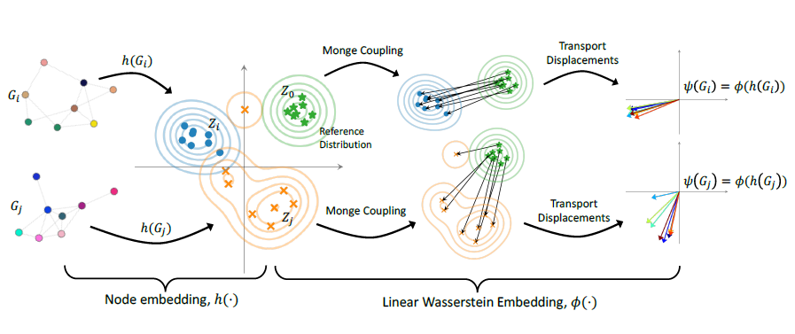

[paper review] : WEGL 이해하기

## Motive

&nbsp;

GIN : two graph isomorphic or not => too strong 

how similar are two graphs? => need a metric for similarity = wasserstein distance 

apply optimal transport to measure the dissimilarity between two graphs 

&nbsp;

## Introduction

&nbsp;

GNN , graph kernel

Wasserstein WL kernel

LOT

논문에서는 

node embedding 과 LOT framework

Wasserstein Embedding for Graph Learning (WEGL) 

&nbsp;

## Background

&nbsp;

### Wasserstein Distances

두 probability distribution 사이의 거리를 표현

wasserstein space Riemannian manifold

geodesic distance on the manifold = 2-Wasserstein distance 

### LOT Framework

Linear Optimal Transportation (LOT) 는 [2] 에서 제시된 방법입니다.

$$M$$ 개의 그래프들에 대해서 그래프의 각 쌍마다 2-Wasserstein distance 를 구하려면, 총 $$M(M-1)/2$$ 번의 거리 계산이 필요했습니다. 즉 기존의 방법은 그래프의 수가 많아질수록 그 수의 제곱만큼 계산이 필요하기 때문에, 큰 dataset 에 적용하기 힘듭니다.

이를 해결하기 위해, LOT 

LOT 는 manifold 위에서의 geodesic distance 를 직접 계산하는 것이 아니라, manifold 에 대한 tangent space 에서의 거리를 계산합니다. 

고정된 reference measure $$\sigma$$ 에 대한 tangent space 로의 projection 을 $$P$$ 라고 하겠습니다.

2-Wasserstein space 의 기하학적 특징에 의해,

$$P(\sigma)$$ 로부터 $$P(\mu)$$ 까지의 거리는  manifold 에서의 $$\sigma$$ 와 $$\mu$$ 의 geodesic distance, 즉 2-Wasserstein distance 와 같습니다.

즉 projection $$P$$ 는 reference measure $$\sigma$$ 로부터의 거리를 보존하는 mapping 입니다.

이를 equidistant azimuthal projection 이라고 부릅니다.

    

위의 그림과 같이 

이 때 reference measure $$\sigma$$ 에 대한 LOT distance $$d_{LOT,\,\sigma}$$ 는 다음과 같이 정의합니다.
$$
d_{LOT,\,\sigma}(\mu,\nu) = \Vert P(\mu)-P(\nu)\Vert_{\sigma}
$$

$$
d_{LOT,\,\sigma}(\mu,\nu) \approx d(\mu,\nu)
$$

> Linearized LOT 

$$
d_{LOT,\,\sigma}(\mu,\nu) = \left( \inf_{\gamma\in\Gamma(\mu,\nu,\sigma)} \int_{\mathcal{Z}\times\mathcal{Z}'\times\mathcal{Z}''} \vert z-z' \vert^2\,d\gamma(z,z',z'') \right)^{1/2}
$$

> Barycentric projection

    

&nbsp;

## Linear Wasserstein Embedding

&nbsp;

reference measure $$\mu_0$$ 

$$f_i$$ 를 $$\mu_0$$ 로부터 $$\mu_i$$ 

Monge map 이라고 하면, $$f_i$$ 는 다음과 같습니다.
$$
f_i = \underset{f\in MP(\mu_0,\mu_i)}{\arg\!\min} \int_{\mathcal{Z}} \vert z-f(z)\vert^2\,d\mu_0(z)
$$

$$(0)$$ 의 projection 을 살짝 수정해 다음과 같이 projection $$\phi$$ 를 정의하면,
$$
\phi(\mu_i) := (f_i-Id)\sqrt{p_i}
$$

$$\phi$$ 는 다음과 같은 특징을 가집니다.

>1. $$\phi$$ provides an isometric embedding for probability measures
>2. $$\phi(\mu_0)=0$$
>3. $$\Vert \phi(\mu_i)-\phi(\mu_0)\Vert_2 = \Vert\phi(\mu_0)\Vert_2=\mathcal{W}_2(\mu_i,\mu_0)$$
>4. $$\Vert\phi(\mu_i)-\phi(\mu_j)\Vert_2\approx\mathcal{W}_2(\mu_i,\mu_j)$$ [3]

다음의 그림을 통해 projection $$\phi$$ 를 이해할 수 있습니다.

    

probability distribution $$\{p_i\}^{M}_{i=1}$$ 

distribution $$p_i$$ 로부터 $$N_i$$ 개의 i.i.d sample 들로 이루어진 $$Z_i = \left[ z^i_1,\cdots,z^i_{N_i} \right]^T\in\mathbb{R}^{N_i\times d}$$  

reference distribution $$p_0$$ 로부터 $$N$$ 개의 i.i.d sampe 들로 이루어진 $$Z_0 = \left[ z^0_1,\cdots,z^0_{N} \right]^T\in\mathbb{R}^{N\times d}$$ 

$$p_i$$ 와 $$p_0$$ 사이의 optimal transport plan

linear programming 을 통해 계산

$$
\pi^{\ast}_{i}
= \underset{\pi\in\Pi_i}{\arg\!\min} \sum^{N}_{j=1}\sum^{N_i}_{k=1} \pi_{jk}\Vert z^0_j - z^i_k\Vert^2_2
\tag{}
$$

$$
\Pi_i = \left\{ \pi\in\mathbb{R}^{N\times N_i} \mid N_i\sum^N_{j=1}\pi_{jk} = N\sum^{N_i}_{k=1}\pi_{jk}=1,\;\forall k\in\{1,\cdots,N_i\},\;\forall j\in\{1,\cdots,N\} \right\}
$$

barycentric projection 을 통해 $$(0)$$ 의 Monge map 을 근사하면,
$$
F_i = N\left( \pi^{\ast}_iZ_i \right)\in\mathbb{R}^{N\times d}
\tag{}
$$

이로부터 projection $$\phi$$ 를 다음과 같이 계산할 수 있습니다.
$$
\phi(Z_i) = (F_i-Z_0)/\sqrt{N}\in\mathbb{N\times d}
\tag{}
$$

&nbsp;

## WEGL : A Linear Wasserstein Embedding for Graphs

&nbsp;

graph classification task

$$M$$ 개의 독립적인 그래프 $$\{G_i=(\mathcal{V}_i,\mathcal{E}_i)\}^{M}_{i=1}$$ 들의

node embedding $$\{Z_i\}^{M}_i=1$$

reference node embedding $$Z_0$$ 로부터 

linear Wasserstein embedding $$\{\phi(Z_i)\}^{M}_{i=1}$$ 

이후 개별적인 classifier 를 통해 graph classification 

end-to-end 학습이 불가능

WEGL 모델의 input 은 그래프 dataset, diffusion layer 의 수, final node embedding 의 local pooling 그리고 classifier 의 종류입니다.

그로부터 output 은 graph classification 의 결과

 

    

### Node embedding

node embedding 에는 다양한 방법인 존재합니다.

만약 parametric encoder 를 사용한다면 학습 과정에서 node embedding 이 달라질 때마다 새로 linear Wasserstein embedding 을 계산해주어야하기 때문에, 

WEGL 에서는 복잡한 계산을 줄이기 위해 non-parametric diffusion layer 를 사용합니다.

주어진 그래프 $$G=(\mathcal{V},\mathcal{E})$$ 의 node feature $$\{x_v\}_{v\in\mathcal{V}}$$ 들과 scalar edge feature $$\{w_{uv}\}_{(u,v)\in\mathcal{E}}$$ 에 대해 다음과 같이 layer-wise propagation rule 을 정의합니다.
$$
x^{(l)}_v = \sum_{u\in N(v)\cup\{v\}}\frac{w_{uv}}{\sqrt{\text{deg}(u)\text{deg}(v)}}\,x^{(l-1)}_u
\tag{}
$$
만약 self-loop $$(v,v)$$ 를 포함해 scalar edge feature 가 주어지지 않은 edge $$(u,v)$$ 들에 대해서는 1 로 설정해줍니다. $$(0)$$ 에서 $$\sqrt{\text{deg}(u)\text{deg}(v)}$$ 를 통해 noramlize 해주는 방법은  GCN 의 propagation rule 에서도 볼 수 있습니다.

만약 edge feaure 가 scalar 가 아닌 multiple features $$w_{uv}\in\mathbb{R}^{F}$$ 로 주어진다면, 

$$\text{deg}_f(u) = \sum_{v\in\mathcal{V}}w_{uv,f}$$ 
$$
x^{(l)}_v = \sum_{u\in N(v)\cup\{v\}}\left( \sum^F_{f=1}\frac{w_{uv,f}}{\sqrt{\text{deg}_f(u)\text{deg}_f(v)}}\right)\,x^{(l-1)}_u
\tag{}
$$

$$()$$ 의 diffusion layer 는 학습 가능한 parameter 가 없기 때문에 간단하며 

마지막으로 diffusion layer 들을 거친 node feature $$\left\{x^{(l)}_v\right\}^{L}_{l=0}$$ 들에 대한 local pooling $$g$$ 의 결과
$$
z_v = g\left( \left\{x^{(l)}_v\right\}^{L}_{l=0} \right) \in\mathbb{R}^d
$$
node embedding 

local pooling $$g$$ 로 concatenation 또는 averaging 을 사용합니다.

$$
h\left(G_i\right) = Z_i = \begin{bmatrix}
z_1,\;\cdots\;,\;z_{\vert \mathcal{V}_i\vert}
\end{bmatrix}^T \in \mathbb{R}^{\vert\mathcal{V}_i\vert\times d}
$$

$$\left\{G_i=(\mathcal{V}_i,\mathcal{E}_i)\right\}^M_{i=1}$$ 들의 node embedding $$\left\{Z_i\right\}^M_{i=1}$$ 

### Reference Distribution

논문에서는 그래프들의 node embeddings $$\cup^M_{i=1} Z_i$$ 에 대해 $$N=\left\lfloor\frac{1}{M}\sum^M_{i=1}N_i \right\rfloor$$ 개의 centroid 들을 가지도록 $$k$$-means clustering 을 통해 reference node embedding $$Z_0$$ 을 계산합니다.

다른 방법으로는 node embedding 들에 대한 Wasserstein barycenter 혹은 normal distribution 으로부터 뽑은 $$N$$ 개의 sample 들로 reference node embedding 을 구성할 수 있습니다. 

linear Wasserstein embedding 의 결과는 reference 에 따라 달라지지만, 실험적으로 WEGL 의 성능은 reference 에 따라 큰 차이를 보이지 않습니다.

### Linear Wasserstein Embedding

$$()$$ 를 통해 reference embedding $$Z_0$$ 에 대한 linear Wasserstein embedding $$\phi(Z_i)\in\mathbb{R}^{N\times d}$$ 를 계산합니다.

그래프들의 최종적인 embedding 들은 차원이 모두 동일합니다.

### Classifier

linear Wasserstein embedding 을 통해 얻은 graph embedding $$\{\phi(Z_i)\}^{M}_{i=1}$$ 

WEGL 의 장점 중 하나는 task 에 맞는 classifier 를 선택할 수 있다는 점입니다.

논문에서는 classifier 로 AuotML, random forest, RBF kernel 을 이용한 SVM 을 사용했습니다.

&nbsp;

## Experimental Evaluation

&nbsp;

### Molecular Property Prediction

ogbg-molhiv

    

### TUD Benchmark

    

### Computation Time

    

&nbsp;

## Future Work

&nbsp;

Gromov-Hausdorff / Gromov-Wasserstein topology instead of Wasserstein topology

&nbsp;

## Appendix

&nbsp;

### A. Wasserstein Dsitance

$$\mathcal{Z},\,\mathcal{Z}'\in\mathbb{R}^d$$ 에서 정의된 두 probability measure $$\mu_i$$ 와 $$\mu_j$$ 가 $$\mathbb{R}^d$$ 의 Lebesgue measure 에 대해 absolutely continuous 하다고 가정

$$\mu_i$$ 와 $$\mu_j$$ 사이의 $$p$$-Wasserstein distance 는 다음과 같이 정의합니다 [].
$$
\mathcal{W}_p(\mu_i,\mu_j) = \left( \inf_{\gamma\in\Gamma(\mu_i,\mu_j)} \int_{\mathcal{Z}\times\mathcal{Z}'}\vert z-z'\vert^p\,d\gamma(z,z') \right)^{1/p}
\tag{}
$$

여기서 $$\Gamma(\mu_i,\mu_j)$$ 는 transport plan $$\gamma$$ 들의 집합으로, transport plan $$\gamma$$  는 모든 Borel subset $$A\in\mathcal{Z}$$ 와 $$B\in\mathcal{Z}'$$ 에 대해 $$\gamma(A\times\mathcal{Z}')=\mu_i(A)$$  와 $$\gamma(\mathcal{Z}\times B)=\mu_j(B)$$ 를 만족합니다. 

[4] 에서는 1-Wasserstein distance

[1] 과 [5] 를 포함한 많은 논문들에서는 2-Wasserstein distance 

$$(P(\mathcal{Z}),\mathcal{W}_2)$$ metric space is a Riemannian manifold

geodesic

Brenier theorem []  에 의해, $$(1)$$ 의 정의는 다음과 동일합니다.
$$
\mathcal{W}_2(\mu_i,\mu_j) = \left( \inf_{f\in MP(\mu_i,\mu_j)} \int_{\mathcal{Z}}\vert z-f(z)\vert^2\,d\mu_i(z) \right)^{1/2}
\tag{2}
$$
$$MP(\mu_i,\mu_j)=\left\{ f:\mathcal{Z}\rightarrow\mathcal{Z}' \mid \mu_j(B)=\mu_i(f^{-1}(B)) \;\; \text{for any Borel set B} \right\}$$ 

$$f\in MP(\mu_i,\mu_j)$$ 를 transport map 이라고 부르며, $$(2)$$ 를 만족하는 optimal transport map 을 Monge map 이라고 합니다.

existence of Monge map?

### B. 

&nbsp;

## Reference

&nbsp;

1. Soheil Kolouri, Navid Naderializadeh, Gustavo K Rohde, and Heiko Hoffmann. [Wasserstein embedding for graph learning](https://arxiv.org/pdf/2006.09430.pdf). arXiv preprint arXiv:2006.09430, 2020.

2. Wei Wang, Dejan Slepcev, Saurav Basu, John A Ozolek, and Gustavo K Rohde. [A linear optimal transportation framework for quantifying and visualizing variations in sets of images](https://link.springer.com/article/10.1007/s11263-012-0566-z). International Journal of Computer Vision, 101(2):254–269, 2013.

3. Caroline Moosmüller and Alexander Cloninger. [Linear optimal transport embedding: Provable
   fast wasserstein distance computation and classification for nonlinear problems](https://arxiv.org/pdf/2008.09165.pdf). arXiv preprint
   arXiv:2008.09165, 2020.

4. Matteo Togninalli, Elisabetta Ghisu, Felipe Llinares-López, Bastian Rieck, and Karsten Borgwardt.
   [Wasserstein Weisfeiler-Lehman graph kernels](https://arxiv.org/pdf/1906.01277.pdf). In Advances in Neural Information Processing
   Systems, pp. 6436–6446, 2019.

5. G. Bécigneul, O.-E. Ganea, B. Chen, R. Barzilay, and T. Jaakkola. [Optimal Transport Graph Neural Networks](https://arxiv.org/pdf/2006.04804.pdf). arXiv preprint arXiv:2006.04804

6. WEGL Github code :  [https://github.com/navid-naderi/WEGL](https://github.com/navid-naderi/WEGL)

